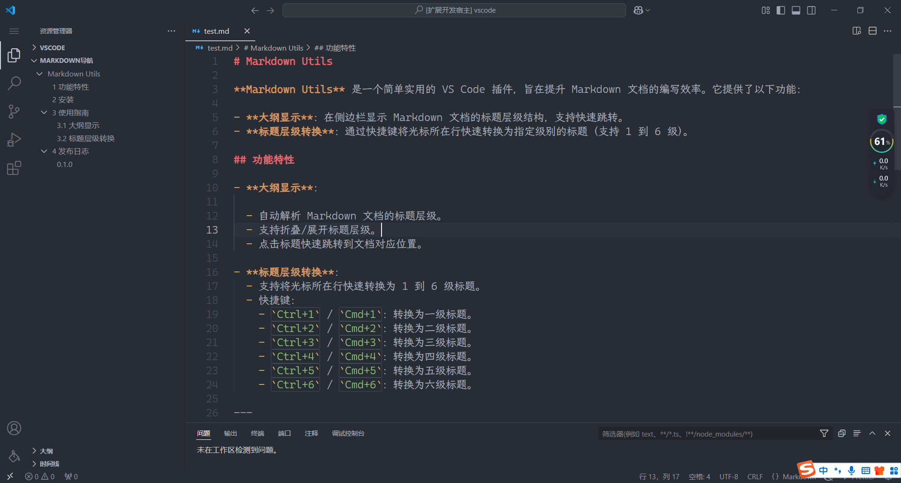

# Markdown Utils

**Markdown Utils** 是一个简单实用的 VS Code 插件，旨在提升 Markdown 文档的编写效率。它提供了以下功能：

- **大纲显示**：在侧边栏显示 Markdown 文档的标题层级结构，支持快速跳转。
- **标题层级转换**：通过快捷键将光标所在行快速转换为指定级别的标题（支持 1 到 6 级）。

## 功能特性

- **大纲显示**：

  - 自动解析 Markdown 文档的标题层级。
  - 支持折叠/展开标题层级。
  - 点击标题快速跳转到文档对应位置。
  - 自动添加标题序号。

- **标题层级转换**：
  - 支持将光标所在行快速转换为 1 到 6 级标题。
  - 快捷键：
    - `Ctrl+1` / `Cmd+1`：转换为一级标题。
    - `Ctrl+2` / `Cmd+2`：转换为二级标题。
    - `Ctrl+3` / `Cmd+3`：转换为三级标题。
    - `Ctrl+4` / `Cmd+4`：转换为四级标题。
    - `Ctrl+5` / `Cmd+5`：转换为五级标题。
    - `Ctrl+6` / `Cmd+6`：转换为六级标题。

## 预览

### 大纲显示

## 安装

1. 打开 VS Code。
2. 进入扩展视图（`Ctrl+Shift+X`）。
3. 搜索 **Markdown Utils**。
4. 点击 **安装**。

## 使用指南

> 可以拖拽移动位置哦 【移动到侧边栏】
> 请参考 https://code.visualstudio.com/docs/editor/custom-layout

请参考 vscode 官方操作示例：

### 大纲显示

1. 打开一个 Markdown 文件。
2. 在侧边栏中查看文档的标题层级结构。
3. 点击标题快速跳转到文档对应位置。

### 标题层级转换

1. 将光标移动到需要转换的行。
2. 按下快捷键（如 `Ctrl+2`）将该行转换为二级标题。

## 发布日志

### 0.0.1

- 初始版本发布。
- 支持大纲显示和标题层级转换。

---

**Enjoy!** 🚀
